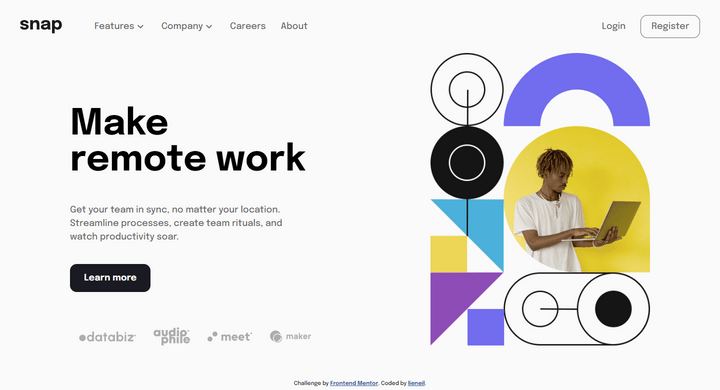
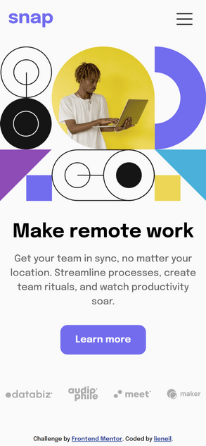
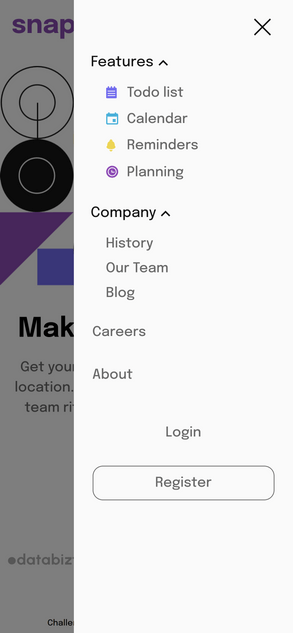

# Frontend Mentor - Intro section with dropdown navigation solution

This is a solution to the [Intro section with dropdown navigation challenge on Frontend Mentor](https://www.frontendmentor.io/challenges/intro-section-with-dropdown-navigation-ryaPetHE5). Frontend Mentor challenges help you improve your coding skills by building realistic projects. 

## Table of contents

- [Overview](#overview)
  - [The challenge](#the-challenge)
  - [Screenshot](#screenshot)
  - [Links](#links)
- [My process](#my-process)
  - [Built with](#built-with)
  - [What I learned](#what-i-learned)
  - [Useful resources](#useful-resources)

## Overview

### The challenge

Users should be able to:

- View the relevant dropdown menus on desktop and mobile when interacting with the navigation links
- View the optimal layout for the content depending on their device's screen size
- See hover states for all interactive elements on the page

### Screenshot


 

### Links

- [LIVE DEMO](https://njvs.github.io/snap-intro-section/)

## My process

### Built with

- Semantic HTML5 markup
- CSS custom properties
- [SASS/SCSS](https://sass-lang.com) - CSS with superpower
- Flexbox
- CSS Grid
- Responsive Web Design

### What I learned

I've made the dropdown behave differently on desktop and mobile. On desktop, only one dorpdown navigation can be open at a time while on mobile, it can be open all dropdown at the same time.

For this to happen, I use `window.matchMedia('(min-width: 912px)').matches` to check for the window's resolution. This will return `true` if the window resolution is grater than 912px else `flase`. Then add or remove blur event on the dropdown trigger depending on the result.
```js
const mql = window.matchMedia('(min-width: 912px)');

function isDesktop(mql) {
  if (mql.matches) { // desktop
    dropdownTriggers.forEach(trigger => trigger.addEventListener('blur', blurHandler))
  } else {           // mobile
    dropdownTriggers.forEach(trigger => trigger.removeEventListener('blur', blurHandler))
  }
}
```

I know it's not required for this challenge, but I feel that adding color animation on the logo and button makes the design beautiful.

But theres a problem for the svg color animation. Basically, I want to mask the anchor tag with the logo and add background color animation, 

```html
<div class="navbar-icon">
   <a href="">snap</a>
</div>
```

```scss
a {
   display: inline-flex;
   width: 85px;
   height: 27px;
   background-color: deepMap($colors, 'theme', 'black');
   mask-image: url(../assets/svgs/logo.svg);
   mask-repeat: no-repeat;
   -webkit-mask-image: url(../assets/svgs/logo.svg);
   -webkit-mask-repeat: no-repeat;
   color: transparent;
   animation: backgroundTheme 50s infinite;
}
```

But the css `mask-image` property only works when i use live server to view the site. I dont know why, so i've decided to just create a new keyframe for the svg and just imbed the svg file directly into the html.

### Useful resources

- [Window interface's matchMedia() method](https://developer.mozilla.org/en-US/docs/Web/API/Window/matchMedia)
- [A Complete Guide to Grid](https://css-tricks.com/snippets/css/complete-guide-grid/) - I alway open this guide everytime I use CSS Grid
- [A Complete Guide to Flexbox](https://css-tricks.com/snippets/css/a-guide-to-flexbox/) - This is for CSS Flexbox
- [An opinionated styleguide for writing sane, maintainable and scalable Sass.](https://sass-guidelin.es/)